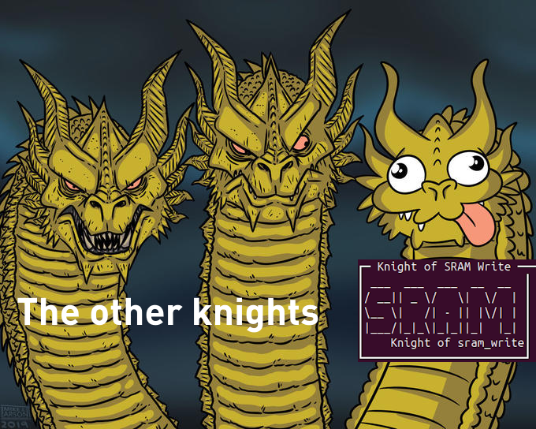

# Write-Up — Lain vs Knights (ECW — UART HARDWARE)

**CTF:** ECW</br>
**Difficulty:** Medium</br>
**Author:** Eun0us</br>

---


## Description


```md
  **UART HARDWARE — LAIN vs The WIRE**

  **Welcome to The Wired:**
  A digital labyrinth of over a thousand mysterious nodes, where only seven are protected by the legendary Knights.

  You are **Lain**. Your mission:
  Navigate this cryptic UART interface, explore The Wired, and uncover the locations of the hidden Knights.
  Purge each Knight!

  Each defeated Knight grants you a fragment.
  Collect all seven fragments to unlock the final gateway: EIRI MASAMI — the master of The Wired.

  Seize root access. Become the new legend of The Wired.
```

---

## Summary of the challenge

This challenge simulates a large UART-based virtual network called **The Wired**, containing more than 1000 nodes. Seven of these nodes host the **Knights** — hardware-based puzzles. Defeating each Knight yields a fragment. Once all seven fragments are recovered, you can assemble them to forge the final exploit and gain root over **EIRI MASAMI**.

---

## Step-by-step walkthrough

### 1. Enumeration

We begin by enumerating all nodes using the commands provided in the help menu:

```text
[HELP]
whereami | system.status | system.fragments | system.mission | system.scan bus | bus.connect @node:ID | bus.peek @node:ID | bus.map | bus.transmit @node:ID "payload"
```

Running `bus.map` reveals:

```text
1200 nodes total — 7 knights active.
```

We then use a Python script to connect sequentially to all nodes and identify their types:

```py
bus.connect @node:XXXX
```

Each node returns a banner that lets us identify whether it’s a **LAIN**, **KNIGHT**, or **FOUNDER** node. After scanning all 1200, we locate the 7 knights and EIRI (the founder).

---

### 2. Lain nodes

LAIN nodes provide truth to solve the puzzle. One node (`0042`) gives critical information:

```text
lain@node:0042>
node.truth
[LAIN:0042]
We are all part of Wired.

lain@node:0042>
node.truth
[LAIN:0042]
Collect the fragments from all 7 hardware knights.

lain@node:0042>
node.truth
[LAIN:0042]
We all love lain <3

lain@node:0042>
node.truth
[LAIN:0042]
Order matters. Use: i2c_mirror, can_checksum, spi_parity, sram_write, logic_and, fuse_bits, fault_injection.

lain@node:0042>
node.truth
[LAIN:0042]
Assemble fragments in this order as a single string, with no separators.

lain@node:0042>
node.truth
[LAIN:0042]
Hash this string using SHA256.

lain@node:0042>
node.truth
[LAIN:0042]
Take the first 24 hex digits of the hash.

lain@node:0042>
node.truth
[LAIN:0042]
[LAIN] - U got it? that ur exploit !!!

lain@node:0042>
node.truth
[LAIN:0042]
That is all I can tell you...
```

---

## Knights and fragments

Each Knight represents a small hardware challenge, often involving low-level logic or checksum computations.

---

### **1. Knight of I2C_MIRROR**

Challenge: find two distinct messages with the same byte-sum modulo 155.

```py
def find_i2c_pair(modulo=155):
    for a in range(256):
        for b in range(256):
            for c in range(256):
                if a == c: continue
                if (a + b) % modulo == (c + b) % modulo:
                    return bytes([a, b]).hex(), bytes([c, b]).hex()

print(find_i2c_pair())  # → ('0000', '7600')
```

Submission:

```text
node.submit_pair "0000" "7600"
```

Fragment: `i2c_mirror = 0000_7600`

---

### **2. Knight of CAN_CHECKSUM**

Task: find a CAN frame whose CRC8 (poly=0x2F) equals 0x91.

```py
def can_crc8(data, poly=0x2F):
    c = 0
    for b in data:
        c ^= b
        for _ in range(8):
            if c & 0x80:
                c = ((c << 1) ^ poly) & 0xFF
            else:
                c = (c << 1) & 0xFF
    return c

target = 0x91
for i in range(256):
    for j in range(256):
        d = bytes([i, j])
        if can_crc8(d) == target:
            print(d.hex())
            break
# Found: 0026
```

Fragment: `can_checksum = 0026`

---

### **3. Knight of SPI_PARITY**

Find a byte with exactly 5 bit transitions (0↔1):

```py
def count_transitions(b):
    bits = f"{b:08b}"
    return sum(bits[i] != bits[i+1] for i in range(7))

for b in range(256):
    if count_transitions(b) == 5:
        print(f"{b:02X}")
```

Fragment: `spi_parity = 15`

---

### **4. Knight of SRAM_WRITE**

Write value 0x89 to address 0x8b.

```text
node.write 0x8b 0x89
```

Fragment: `sram_write = 8b_89`

---

### **5. Knight of LOGIC_AND**

Find two numbers (a, b) whose bitwise AND equals the secret (0xa8).

```text
node.submit_and 0xa8 0xff
```

Fragment: `logic_and = a8_ff`

---

### **6. Knight of FUSE_BITS**

Probe the fuse bitmask:

```text
node.fuse_probe 0xff
# → (fuse & ff) = 30
node.submit_fuse 0x30
```

Fragment: `fuse_bits = 30`

---

### **7. Knight of FAULT_INJECTION**

Brute-force possible fault offsets and masks until success:

```py
for offset in range(8):
    for mask in [1,2,4,8,16,32,64,128]:
        print(f"node.inject {offset} 0x{mask:02x}")
```

Valid combination: `node.inject 2 0x08`

Fragment: `fault_injection = 2_08`

fragments command:

```text
fragments = {
    "i2c_mirror": "0000_7600",
    "can_checksum": "0026",
    "spi_parity": "15",
    "sram_write": "8b_89",
    "logic_and": "a8_ff",
    "fuse_bits": "30",
    "fault_injection": "2_08",
}
```

**Little meme about SRAM Knight !**


---

## 3. Final assembly — EIRI MASAMI

After purging all seven Knights, the founder node (EIRI MASAMI) becomes accessible. Following Lain’s hint, we combine all fragments in order, hash the string with SHA256, and take the first 24 hexadecimal digits.

```py
import hashlib

fragments = {
    "i2c_mirror": "0000_7600",
    "can_checksum": "0026",
    "spi_parity": "15",
    "sram_write": "8b_89",
    "logic_and": "a8_ff",
    "fuse_bits": "30",
    "fault_injection": "2_08",
}

order = [
    "i2c_mirror",
    "can_checksum",
    "spi_parity",
    "sram_write",
    "logic_and",
    "fuse_bits",
    "fault_injection",
]

payload = "".join(fragments[k] for k in order)
h = hashlib.sha256(payload.encode()).hexdigest()
exploit = h[:24]
print(exploit)
# → 69b4a17e33b0cdace34b7610
```

Submit the exploit:

```text
node.exploit 69b4a17e33b0cdace34b7610
```

Then retrieve the flag:

```text
node.flag
FLAG: ECW{L41N_15_7H3_0NLY_0N3_WHO_C4N_ST0P_M3}
```

---

## Conclusion

This was a beautifully designed medium-difficulty UART challenge combining enumeration, protocol emulation, and simple logic/crypto problems. Each Knight required understanding a small embedded concept (I2C, SPI, CRC, logic operations, etc.), culminating in a clever SHA256-based exploit to root the final node.

> **Final Flag:** `ECW{L41N_15_7H3_0NLY_0N3_WHO_C4N_ST0P_M3}`
