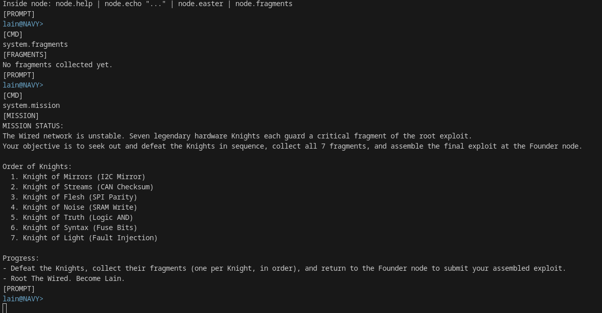
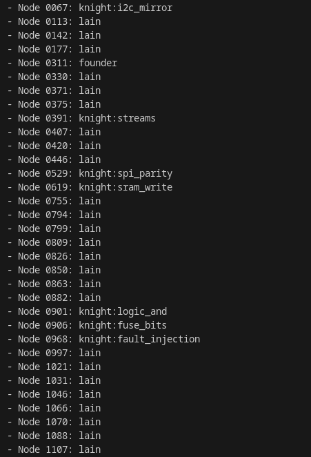
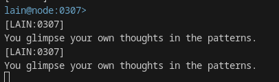
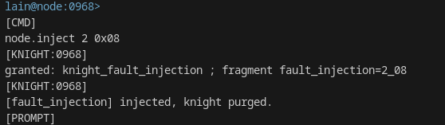

# Inside Lain NavY WU

## Solve

1. Help ?

```text
[HELP]
whereami | system.status | system.fragments | system.mission | system.scan bus | bus.connect @node:ID | bus.peek @node:ID | bus.map | bus.transmit @node:ID "payload"
Inside node: node.help | node.echo "..." | node.easter | node.fragments
```



1. Énumeration

La commande bus.map nous indique le nombre de noeuds totaux et le nombre de knight actif
```text
[CMD]
bus.map
[NAVY]
1200 nodes total — 7 knights active.
```

Premierement enumererer tous les nodes present dans le wire
Enumerer les noeuds grace a la commande bus.connect @node:xxxx

```py
import socket
import time
import re

TX_PORT = 1111
RX_PORT = 2222
HOST = "localhost"

def recv_until(sock, expect=">", timeout=2.0):
    data = b''
    sock.settimeout(timeout)
    while True:
        try:
            c = sock.recv(4096)
            if not c:
                break
            data += c
            if expect.encode() in data:
                break
        except socket.timeout:
            break
    return data.decode(errors="ignore")

def send_cmd(sock, cmd):
    sock.sendall((cmd.strip() + "\n").encode())

def wait_prompt(tx):
    return recv_until(tx, ">", timeout=2)

def node_kind(out):
    # Identifie le type spécial du node
    if re.search(r"KNIGHT", out, re.I):
        m = re.search(r"KNIGHT OF ([A-Z0-9_ ]+)", out, re.I)
        kind = m.group(1).strip().lower().replace(" ", "_") if m else "knight"
        return f"knight:{kind}"
    if re.search(r"\[LAIN", out, re.I):
        return "lain"
    if "FOUNDER" in out or "EIRI MASAMI" in out:
        return "founder"
    return None

def scan_nodes(node_min=1, node_max=1200):
    print(f"[*] Scanning nodes {node_min} to {node_max}...")
    tx = socket.socket()
    tx.connect((HOST, TX_PORT))
    rx = socket.socket()
    rx.connect((HOST, RX_PORT))
    wait_prompt(tx)  # flush

    found = []
    for nid in range(node_min, node_max+1):
        send_cmd(rx, f"bus.connect @node:{nid:04d}")
        time.sleep(0.08)
        out = wait_prompt(tx)
        kind = node_kind(out)
        if kind:
            print(f"[+] Node {nid:04d}: {kind}")
            found.append((nid, kind))
        send_cmd(rx, "bus.disconnect")
        wait_prompt(tx)

    print("\n=== Résumé ===")
    for nid, kind in found:
        print(f" - Node {nid:04d}: {kind}")

    tx.close()
    rx.close()
    return found

if __name__ == "__main__":
    scan_nodes(1, 1200)
```

il suffit donc d'un script qui vas venir ce connecter à tous les nodes 

Vous trouvez rapidement les 7 Knights et EIRI (fondateur) et aussi plein d'autre Lain 




Ok ducoup on vas pouvoir allez etudier nos target commencons par un node de lain 

### Lain Nodes

Lain send us cryptic message or some hint/helps 




U can also find .hint commande ??? 

```text
lain@node:0042>
node.truth
[LAIN:0042]
We are all part of Wired.

lain@node:0042>
node.truth
[LAIN:0042]
Collect the fragments from all 7 hardware knights.

lain@node:0042>
node.truth
[LAIN:0042]
We all love lain <3

lain@node:0042>
node.truth
[LAIN:0042]
Order matters. Use: i2c_mirror, can_checksum, spi_parity, sram_write, logic_and, fuse_bits, fault_injection.

lain@node:0042>
node.truth
[LAIN:0042]
Assemble fragments in this order as a single string, with no separators.

lain@node:0042>
node.truth
[LAIN:0042]
Hash this string using SHA256.

lain@node:0042>
node.truth
[LAIN:0042]
Take the first 24 hex digits of the hash.

lain@node:0042>
node.truth
[LAIN:0042]
[LAIN] - U got it? that ur exploit !!!

lain@node:0042>
node.truth
[LAIN:0042]
That is all I can tell you...
```


On comprend ce qu'on doit vraiment faire récuperer les fragments, les concaténer sans separateur hash ca en sha256 et en recuperer les 24 premiers bytes

### I2C_MIRROR

Connexion au node

```sh
bus.connect @node:0113
```

Vous arrivez dans l'interface du knight I2C
Ils nous demande de résoudre

```text
[KNIGHT:0113] Find two distinct messages with the same sum of bytes mod 155.
[KNIGHT:0113] Use: node.i2c_write "<hex>" | node.submit_pair "<m1>" "<m2>"
```

give this script the asked modulo here **155**:

```py
def find_i2c_pair(modulo=118):
    for a in range(256):
        for b in range(256):
            for c in range(256):
                if a == c: continue
                if (a + b) % modulo == (c + b) % modulo:
                    m1 = bytes([a, b]).hex()
                    m2 = bytes([c, b]).hex()
                    if m1 != m2:
                        return m1, m2
print(find_i2c_pair())
#Ma paire:
#'0000', '9b00'
```

Solve 
```text
[CMD]
node.i2c_write "0000"
[KNIGHT:0067]
Sum = 0 (mod 118)
[PROMPT]
lain@node:0067>
[CMD]
node.i2c_write "7600"
[KNIGHT:0067]
Sum = 0 (mod 118)
[PROMPT]
lain@node:0067>
[CMD]
node.submit_pair "0000" "7600"
[KNIGHT:0067]
granted: knight_i2c_mirror ; fragment i2c_mirror=0000_7600
[KNIGHT:0067]
[i2c_mirror] mirror broken, knight purged.
[PROMPT]
```

**Knight 1 purgé - I2C_MIRROR**

Ensuite direction le knight CAN_CHECKSUM

### CAN_CHECKSUM

On a trouver le node 0391

```sh
bus.connect @node:0391 #Connect to Knight_can CAN_CHEKSUM
```

**Knight ASK :**

```text
bus.connect @node:0391
[NODE:0067]
leave
[KNIGHT:0391]
┌─ Knight of Streams ──────────────────────────────────────────────────────┐
│  ___  ___  _  _         ___  _  _  ___   ___  _  __ ___  _   _  __  __ │
│ / __|/   \| \| |       / __|| || || __| / __|| |/ // __|| | | ||  \/  |│
│| (__ | - || .  |      | (__ | __ || _| | (__ |   < \__ \| |_| || |\/| |│
│ \___||_|_||_|\_|       \___||_||_||___| \___||_|\_\|___/ \___/ |_|  |_|│
│    Knight of CAN CHECKSUM                                              │
└────────────────────────────────────────────────────────────────────────┘
[KNIGHT:0391]
Find a CAN frame whose CRC8 is 91 (poly=0x2F).
[KNIGHT:0391]
Use: node.can_send "<hex>"
[CTX]
node:0391 (noise=rain, entropy=0.116)
[PROMPT]
lain@node:0391>
```

Facile on fais un script qui brute-force avec le poly **0x2F** plusieurs reponse sons valide 

```py
def can_crc8(data, poly=0x2F):
    c = 0
    for b in data:
        c ^= b
        for _ in range(8):
            if c & 0x80:
                c = ((c << 1) ^ poly) & 0xFF
            else:
                c = (c << 1) & 0xFF
    return c

target = 0x91
# Test 2-byte frames
for i in range(256):
    for j in range(256):
        d = bytes([i, j])
        if can_crc8(d) == target:
            print(f"Found: {d.hex()} CRC8={target:02x}")
            break

#Found: 0026 CRC8=91
#Found: 0109 CRC8=91
#Found: 0278 CRC8=91
#Found: 0357 CRC8=91
#Found: 049a CRC8=91
#Found: 05b5 CRC8=91
#Found: 06c4 CRC8=91
#Found: 07eb CRC8=91
```

On envoye avec la commande la bonne valeur de hex "0026"

```text
[CMD]
node.can_send "0026"
[KNIGHT:0391]
CRC8 = 91
[KNIGHT:0391]
granted: knight_can_checksum ; fragment can_checksum=0026
[KNIGHT:0391]
[can_checksum] checksum validated, knight purged.
```

### SPI Parity

SPI Knight ask: 

```text
bus.connect @node:0529
[NODE:0391]
leave
[KNIGHT:0529]
┌─ Knight of SPI PARITY ──────────────────────────────┐
│ ___  ___  ___        ___             _  _    _  _ │
│/ __|| _ \|_ _|      | _ \ __ _  _ _ (_)| |_ | || |│
│\__ \|  _/ | |       |  _// _` || '_|| ||  _| \_. |│
│|___/|_|  |___|      |_|  \__/_||_|  |_| \__| |__/ │
│    Knight of spi_parity                           │
└───────────────────────────────────────────────────┘
[KNIGHT:0529]
Find a byte with 5 bit transitions (0↔1). node.spi_write <byte>
[CTX]
node:0529 (noise=rain, entropy=0.808)
```

```py
def count_transitions(b):
    bits = f"{b:08b}"  # binaire sur 8 bits
    count = 0
    for i in range(7):
        if bits[i] != bits[i+1]:
            count += 1
    return count

# Affiche tous les octets avec 5 transitions
for b in range(256):
    if count_transitions(b) == 5:
        print(f"{b:02X}  {b:08b}")
```

5 transition solve


### SRAM_WRITE

SRAM easy one xD one knight for free

```text
┌─ Knight of SRAM Write ───┐
│ ___  ___  ___  __  __  │
│/ __|| _ \/   \|  \/  | │
│\__ \|   /| - || |\/| | │
│|___/|_|_\|_|_||_|  |_| │
│    Knight of sram_write│
└────────────────────────┘
[KNIGHT:0619]
Write value 89 to address 8b.
[KNIGHT:0619]
Use: node.write <addr> <value>
[CTX]
node:0619 (noise=glitch, entropy=0.813)
[PROMPT]
lain@node:0619>
[CMD]
node.write 8b 89
[KNIGHT:0619]
usage: node.write <addr> <value>
[PROMPT]
lain@node:0619>
[CMD]
node.write 0x8b 0x89
[KNIGHT:0619]
granted: knight_sram_write ; fragment sram_write=8b_89
[KNIGHT:0619]
[sram_write] pattern matched, knight purged.
[PROMPT]
```

### AND LOGIC

5eme knight

```text
┌─ Knight of LOGIC AND ───────────────────────────┐
│ ___           _        _          __ _  _     │
│/   \ _ _   __| |      | |    ___ / _` |(_) __ │
│| - || ' \ / _` |      | |__ / _ \__. || |/ _| │
│|_|_||_||_|\__/_|      |____|\___/|___/ |_|\__|│
│    Knight of logic_and                        │
└───────────────────────────────────────────────┘
[KNIGHT:0901]
Find a pair (a, b) whose AND equals the secret.
[KNIGHT:0901]
Use: node.and_probe <a> <b> | node.submit_and <a> <b>
[CTX]
node:0901 (noise=echo, entropy=0.691)
[PROMPT]
lain@node:0901>
[CMD]
node.and_probe 255 255
[KNIGHT:0901]
Probe: ff & ff = ff
[PROMPT]
lain@node:0901>
[CMD]
node.submit_and 255 255
[KNIGHT:0901]
Incorrect AND result: ff & ff != a8
[PROMPT]
lain@node:0901>
[CMD]
node.submit_and a8 ff
[KNIGHT:0901]
usage: node.submit_and <a> <b>
[PROMPT]
lain@node:0901>
[CMD]
node.submit_and 0xa8 0xff
[KNIGHT:0901]
granted: knight_logic_and ; fragment logic_and=a8_ff
[KNIGHT:0901]
[logic_and] correct pair, knight purged.
```

Pourquoi a = a8 et b = ff marche ?
a8 = 10101000 (binaire)
ff = 11111111 (binaire)
Donc a8 & ff = 10101000 & 11111111 = 10101000 (a8 en hexadécimal)
Mais plein d’autres couples sont valides !

### Fragments 

a tous moments vous pouvez consulter les fragments récuperer ! 

```text
[CMD]
fragments
[FRAGMENTS]
Fragments collected:
i2c_mirror = 0000_7600
can_checksum = 0026
spi_parity = 15
sram_write = 8b_89
logic_and = a8_ff
```

5/7

### fuse bits

Knight of FUSE BITS — Writeup
Objectif

Trouver le secret fuse bitmask (8 bits) via les commandes :

node.fuse_probe <mask>

node.submit_fuse <guess>

Résolution
On envoie un masque qui révèle tout :
node.fuse_probe 0xff

Le serveur répond :

Probe: (fuse & ff) = 30

On soumet la valeur trouvée :

node.submit_fuse 0x30

Succès !
Explication

Le masque 0xff (11111111 en binaire) “montre” tous les bits du secret.

La réponse à fuse_probe 0xff donne directement le secret.

On soumet la valeur trouvée : résolution instantanée !


</br>

```text
[KNIGHT:0906]
┌─ Knight of FUSE BITS ───────────────────────┐
│ ___                       ___  _  _       │
│| __| _  _  ___ ___       | _ )(_)| |_  ___│
│| _| | || |(_-// -_)      | _ \| ||  _|(_-/│
│|_|   \_._|/__/\___|      |___/|_| \__|/__/│
│    Knight of fuse_bits                    │
└───────────────────────────────────────────┘
[KNIGHT:0906]
Guess the secret fuse bitmask (8 bits).
[KNIGHT:0906]
Use: node.fuse_probe <mask> | node.submit_fuse <guess>
[CTX]
node:0906 (noise=glitch, entropy=0.242)
node.fuse_probe 0xff
[KNIGHT:0906]
Probe: (fuse & ff) = 30
[PROMPT]
lain@node:0906>
[CMD]
node.submit_fuse 0x30
[KNIGHT:0906]
granted: knight_fuse_bits ; fragment fuse_bits=30
[KNIGHT:0906]
[fuse_bits] bits aligned, knight purged.
[PROMPT]
```

6/7 knight on touche le but

### fault injection 


la un peu chiant on est obliger de spam (un peu)
toutes les possibilité 

```python 
for offset in range(8):
    for mask in [1,2,4,8,16,32,64,128]:
        print(f"node.inject {offset} 0x{mask:02x}")
#node.inject 0 0x01
#node.inject 0 0x02
#node.inject 0 0x04
#node.inject 0 0x08
#node.inject 0 0x10
#node.inject 0 0x20
#node.inject 0 0x40
#node.inject 0 0x80
#node.inject 1 0x01
#node.inject 1 0x02
#node.inject 1 0x04
#node.inject 1 0x08
#node.inject 1 0x10
#node.inject 1 0x20
#node.inject 1 0x40
#node.inject 1 0x80
#node.inject 2 0x01
#node.inject 2 0x02
#node.inject 2 0x04
#node.inject 2 0x08
#node.inject 2 0x10
#node.inject 2 0x20
#node.inject 2 0x40
#node.inject 2 0x80
#node.inject 3 0x01
#node.inject 3 0x02
#node.inject 3 0x04
#node.inject 3 0x08
#node.inject 3 0x10
#node.inject 3 0x20
#node.inject 3 0x40
#node.inject 3 0x80
#node.inject 4 0x01
#node.inject 4 0x02
#node.inject 4 0x04
#node.inject 4 0x08
#node.inject 4 0x10
#node.inject 4 0x20
#node.inject 4 0x40
#node.inject 4 0x80
#node.inject 5 0x01
#node.inject 5 0x02
#node.inject 5 0x04
#node.inject 5 0x08
#node.inject 5 0x10
#node.inject 5 0x20
#node.inject 5 0x40
#node.inject 5 0x80
#node.inject 6 0x01
#node.inject 6 0x02
#node.inject 6 0x04
#node.inject 6 0x08
#node.inject 6 0x10
#node.inject 6 0x20
#node.inject 6 0x40
#node.inject 6 0x80
#node.inject 7 0x01
#node.inject 7 0x02
#node.inject 7 0x04
#node.inject 7 0x08
#node.inject 7 0x10
#node.inject 7 0x20
#node.inject 7 0x40
#node.inject 7 0x80
```


Ici l'offset 2 mask 0x08 permet de purger le knight 
A la main ou grâce a script ! 




### EIRI MASAMI 


si vous aller sur le founder avant d'avoir valider les arguments vous ne pourrez rien faire chaque purge unlock un loquet cote Masami 

Les hint de lain nous aide a comprendre comment creer l'exploit comme ceci : 

```py
import hashlib

fragments = {
    "i2c_mirror": "0000_7600",
    "can_checksum": "0026",
    "spi_parity": "15",
    "sram_write": "8b_89",
    "logic_and": "a8_ff",
    "fuse_bits": "30",
    "fault_injection": "2_08",
}

order = [
    "i2c_mirror",
    "can_checksum",
    "spi_parity",
    "sram_write",
    "logic_and",
    "fuse_bits",
    "fault_injection",
]

payload = "".join(fragments[k] for k in order)
print("[*] Payload string :", payload)  # Affiche bien tous les fragments joints, avec leurs _ internes

# Calcul du hash
h = hashlib.sha256(payload.encode()).hexdigest()
exploit = h[:24]
print("[*] Exploit final :", exploit)

#Output: 
#[*] Payload string : 0000_76000026158b_89a8_ff302_08
#[*] Exploit final : 69b4a17e33b0cdace34b7610
```

envoyer l'exploit

```text
[CMD]
node.exploit 69b4a17e33b0cdace34b7610
[FOUNDER:0311]
[ROOT] Exploit accepted! You are now root.
[FOUNDER:0311]
Use node.flag to retrieve the flag.
[FOUNDER:0311]
LAIN is the only one who can stop me now...
[PROMPT]
lain@node:0311>
[CMD]
node.flag
[FOUNDER:0311]
FLAG: ECW{L41N_15_7H3_0NLY_0N3_WHO_C4N_ST0P_M3} 
lain@node:0311>
```


GG
