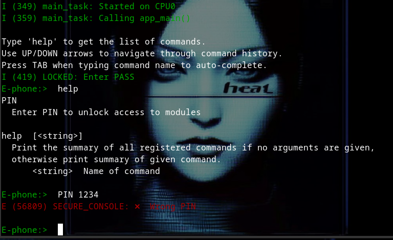
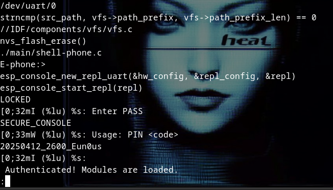
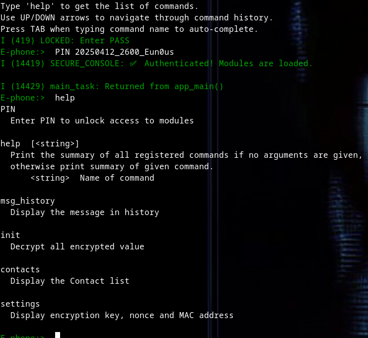
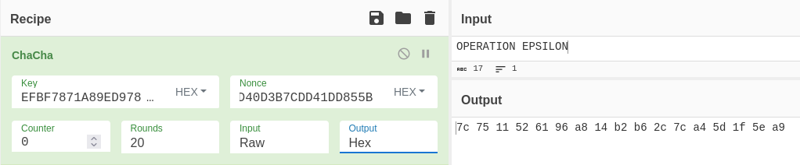
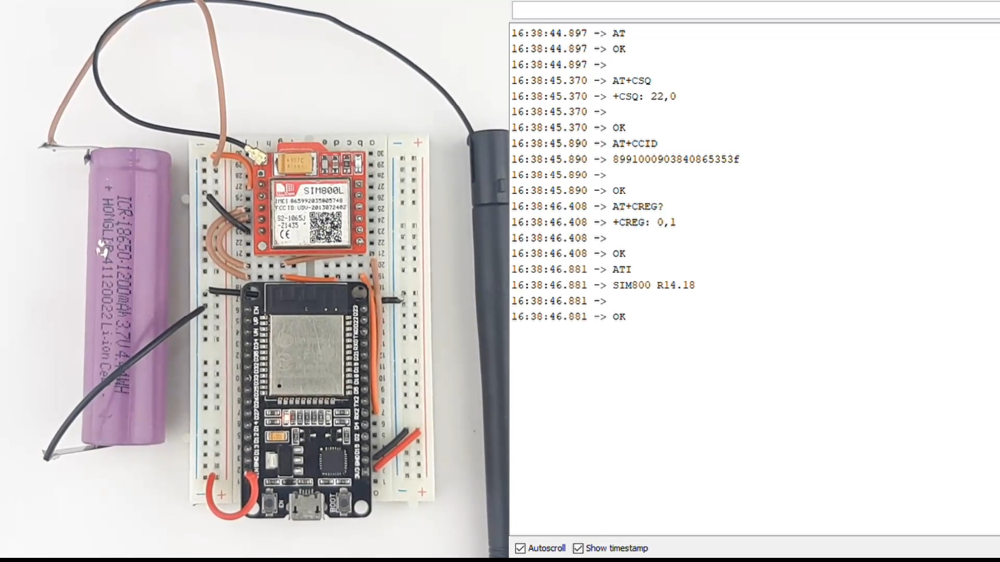

# Write-Up Shell-Phone

**CTF**: PWNME


## Description 

`
In this "Shell-Phone" challenge, you must interact with an ESP32 flashed with a special firmware.
The objective is to find a contact called "MASTER", retrieve a hidden message from the history,
as well as the encryption keys of the device. You will then need to send the encrypted message
to MASTER.
Rules:
    - No smartphones allowed to send the message.
    - Solve the challenge using only the provided hardware.

Once the message is correctly sent, you will receive the flag. Good luck!
`

- **Difficulty:** medium
- **Author:** Eun0us
- **Materials supplied:** ESP32 (Shell-Phone), Sim800L, SIM-Card

## Context 
Learn How to get in esp console, .

## Introduce 

Get a micro-usb get a serial tty to the shell-phone 

I use esptool.py & idf.py for all the *solve*

### PIN

Try to access the **shell** 

Use [idf.py monitor](https://docs.espressif.com/projects/esp-idf/en/stable/esp32/api-guides/tools/idf-monitor.html)

go inside a esp-idf project 
`idf.py monitor`



</br>
The Phone is lock by a PIN so ...
*dump the firmware !* 

`esptool.py --port /dev/ttyUSB0 read_flash 0x00000 0x400000 firmware.bin`

`strings shell-phone.bin | less`



</br>

**PIN:** `20250412_2600_Eun0us`



Now we have some commands 
- msg_history *Display the message in history*
- init        *Decrypt all encrypted value*
- contacts    *Display the Contact list*
- settings    *Display encryption key, nonce and MAC address*

Sooo use it !

```sh
E-phone:>  init
E-phone:>  msg_history
MESSAGES SEND TO MASTER
	OPERATION EPSILON

E-phone:>  contacts
SOS     : +33212
MASTER  : +33634615173

E-phone:>  settings
==== Device Crypto Settings ====
MAC Address: C8:F0:9E:F1:91:54
ChaCha20 Key (32 bytes): EFBF7871A89ED978E47820FE9F665214CE9FAC5801DC94D2C98B6512DC877CFC
ChaCha20 Nonce (12 bytes): 4A1ADDD40D3B7CDD41DD855B

E-phone:>  
```

Key & Nonce are generated by MAC address.


### Send SMS 

*You will then need to send the encrypted message to MASTER.*

Chacha20 Key   (EFBF7871A89ED978E47820FE9F665214CE9FAC5801DC94D2C98B6512DC877CFC)
Chacha20 Nonce (4A1ADDD40D3B7CDD41DD855B)


</br>

Cypher-Text: *7c 75 11 52 61 96 a8 14 b2 b6 2c 7c a4 5d 1f 5e a9*

So we have to send the cypher data to +33634615173 

In the shell-phone there is no command for sending sms

So get a sim800L a sim build ur own phone !


</br>


Now ..
Just erase the firmware and upload a new one 

```cpp
#include <HardwareSerial.h>

#define MODEM_RX 16  // ESP32 RX pin (connected to SIM800L TX)
#define MODEM_TX 17  // ESP32 TX pin (connected to SIM800L RX)

HardwareSerial sim800(1);

String phoneNumber = "+33634615173";
String messageHex = "7c 75 11 52 61 96 a8 14 b2 b6 2c 7c a4 5d 1f 5e a9";

// Helper to send AT command and print response
void sendATCommand(const char *cmd, int waitTime = 1000) {
  sim800.println(cmd);
  delay(waitTime);
  while (sim800.available()) {
    Serial.write(sim800.read());
  }
}

// Function to read all received SMS
void readSMS() {
  Serial.println("Reading received SMS messages...");
  sim800.println("AT+CMGL=\"ALL\"");  // List all messages
  delay(2000);

  while (sim800.available()) {
    Serial.write(sim800.read());  // Output SMS data to serial monitor
  }
}

void setup() {
  Serial.begin(115200);
  sim800.begin(9600, SERIAL_8N1, MODEM_RX, MODEM_TX);

  Serial.println("Initializing SIM800L...");
  delay(1000);

  // Set SMS mode to text
  sendATCommand("AT");
  sendATCommand("AT+CMGF=1");

  // Send SMS
  sendATCommand(("AT+CMGS=\"" + phoneNumber + "\"").c_str());
  delay(1000);
  sim800.print(messageHex);
  sim800.write(26);  // Ctrl+Z to send
  Serial.println("Message sent!");
  delay(5000);  // Wait a few seconds for any incoming messages

  // Read received SMS
  readSMS();
}

void loop() {
  // You can optionally read SMS regularly
  // Uncomment below if you want to keep checking for new messages
  /*
  delay(60000);  // Check every 60 seconds
  readSMS();
  */
}
```


OutPut 

```
Initializing SIM800L...
AT

OK
AT+CMGF=1

OK
AT+CMGS="+33634615173"

> 7c 75 11 52 61 96 a8 14 b2 b6 2c 7c a4 5d 1f 5e a9
+CMGS: 37

OK
Message sent!
Reading received SMS messages...
AT+CMGL="ALL"

+CMGL: 1,"REC READ","+33612345678","","25/04/13,14:32:10+08"
PWNME{3sP32_4r_S0_Fun_l3git}

OK
```

GG u got the flag !
